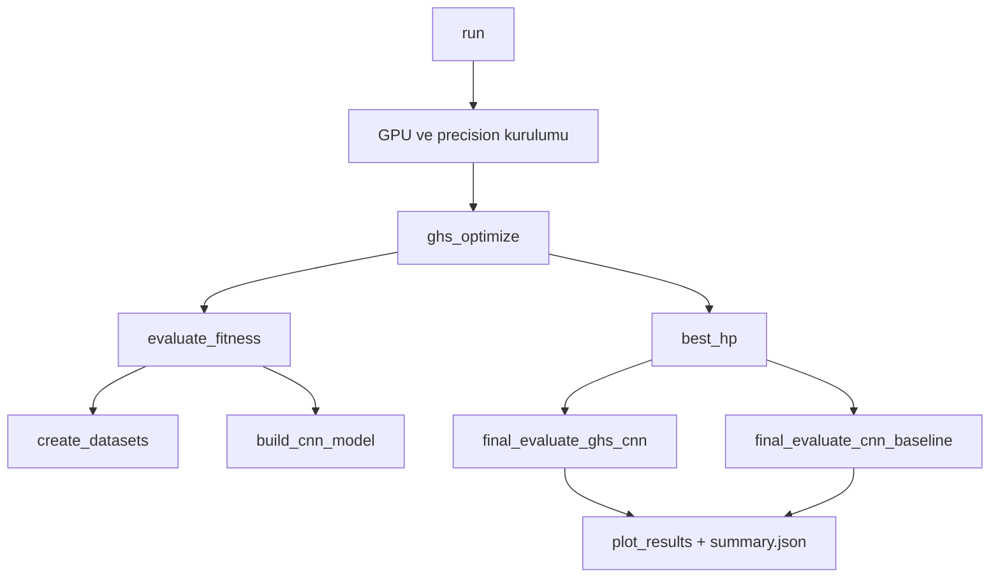

# frkn

Bu proje, **ikili atık sınıflandırma** (Organic vs Recyclable) için TensorFlow/Keras tabanlı bir CNN kurar ve hiperparametreleri **G-HS (Global-best Harmony Search) + OBL (Opposition-Based Learning) + dinamik PAR/BW** ile optimize eder. Tüm akış tek dosyada (`kod.py`) toplanmıştır.

---

## 1) Projenin amacı

Kod iki yaklaşımı karşılaştırır:

1. **Baseline CNN** (sabit hiperparametre)
2. **G-HS ile optimize edilmiş CNN** (SE + Residual + label smoothing)

Çıktılar:
- Test loss / accuracy
- Baseline ↔ optimize model karşılaştırması
- Yakınsama grafikleri (`ghs_results.png`)
- Özet rapor (`summary.json`)

---

## 2) Uçtan uca mimari (kodla birebir)



Akış sırası:
1. **Başlangıç**: seed, GPU modu, mixed precision politikası.
2. **Optimizasyon**: G-HS hiperparametre arama döngüsü.
3. **Fitness**: her aday için kısa eğitim + `val_loss` ölçümü.
4. **Final**: en iyi hiperparametre ile tam eğitim, baseline ile karşılaştırma.
5. **Raporlama**: görsel + JSON özet.

---

## 3) Sayısal hassasiyet (FP16 / BF16 / FP32) – en detaylı katman

Koddaki precision yönetimi doğrudan GPU tespitine bağlıdır:

### 3.1 Karar akışı

1. GPU yoksa: **FP32** (CPU).
2. GPU varsa ve cihaz adı `DML`/`PluggableDevice` ise (DirectML): **FP32** zorunlu (DirectML tarafında mixed precision kararlılığı sınırlı olabildiği için).
3. GPU varsa ve DirectML değilse:
   - Önce `mixed_float16`
   - olmazsa `mixed_bfloat16`
   - o da olmazsa FP32

### 3.2 “fp16 mi fp32 mi bf16 mi?” sorusunun kod karşılığı

Bu dokümanda `fp16=float16`, `fp32=float32`, `bf16=bfloat16` anlamında kullanılır.

Bu projede **öncelik sırası**:
1. `mixed_float16`
2. `mixed_bfloat16`
3. `float32`

### 3.3 Neden bu sıra kullanılıyor?

- NVIDIA tarafında FP16, uygun GPU mimarilerinde Tensor Core/yarı hassasiyet hızlandırması ve daha düşük bellek bant genişliği tüketimi sayesinde çoğu eğitim iş yükünde avantaj sağlayabilir.
- FP16 destek problemi olursa BF16 denenir.
- DirectML ortamında mixed precision yerine FP32 tercih edilerek stabilite korunur.

### 3.4 Katman bazlı dtype davranışı

Global policy mixed olsa bile kod kritik yerleri bilinçli şekilde FP32 seviyesinde sabitler:

- Augmentation girişi: `Lambda(cast float32)`
- `RandomFlip/Rotation/Zoom/Contrast`: `dtype='float32'`
- Çıkış katmanı: `Dense(..., dtype='float32')`

Amaç:
- bazı ortamlarda augmentation + BF16 uyumsuzluklarını azaltmak,
- binary sınıflandırma çıkışında numerik kararlılığı korumak.

---

## 4) Veri katmanı (create_datasets)

Kaynaklar (proje kök dizinine göre relatif yollar):
- `dataset/train`
- `dataset/test`

İşleyiş:
1. `image_dataset_from_directory` ile train/val (`validation_split=0.2`) üretilir.
2. Test seti ayrı dizinden yüklenir.
3. `QUICK_TEST` veya `DATASET_SIZE` ile örnek sayısı kısıtlanabilir.
4. Batch-size bazlı cache kullanılır (`_gen_cache`).
5. `prefetch(AUTOTUNE)` ile pipeline hızlandırılır.

---

## 5) Modelleme katmanı – önerilen G-HS-CNN

### 5.1 Blok topolojisi

Her blok:
1. Conv2D
2. BatchNorm
3. ReLU
4. Conv2D
5. BatchNorm
6. SE block
7. Residual Add (gerekirse 1x1 projeksiyon)
8. ReLU
9. MaxPool
10. SpatialDropout2D

Filtre sayısı her blokta 2x artar, üst sınır `MAX_FILTERS` ile kısıtlanır.

### 5.2 SE (Squeeze-and-Excitation)

`_se_block` kanal dikkatini öğrenir:
- GAP → küçük Dense(ReLU) → Dense(sigmoid) → kanal çarpımı.

Bu sayede hangi feature map’lerin daha kritik olduğu örnek bazında ağırlıklandırılır.

### 5.3 Residual bağlantı

`shortcut.shape[-1] != f` ise 1x1 Conv + BN ile kanal eşleştirme yapılıp toplama uygulanır.
Bu, daha derin yapılarda gradyan akışını korur.

### 5.4 Kayıp/optimizer

- Optimizer: Adam (`learning_rate` optimize edilen hiperparametre)
- Loss: `BinaryCrossentropy(label_smoothing=0.05)`
- Metric: `accuracy`

---

## 6) Baseline CNN

Referans model, sabit ve daha klasik bir yapıdır:
- 3 conv blok (32→64→128)
- BN + MaxPool
- Flatten + Dense
- Sigmoid çıkış (`dtype='float32'`)

Optimizasyon yoktur; karşılaştırma için sabit bir çıpa görevi görür.

---

## 7) G-HS + OBL + dinamik PAR/BW optimizasyonu

Optimize edilen hiperparametreler:
- `filters`, `kernel_size`, `num_blocks`, `dropout`, `learning_rate`, `batch_size`, `dense_units`

Temel adımlar:
1. Harmony Memory başlatılır (ilk eleman `ELITE_SEED`).
2. Her iterasyonda yeni aday üretilir.
3. HMCR ile bellekten seçim yapılır.
4. PAR/BW ile ayar yapılır (PAR artar, BW üstel azalır).
5. OBL kolunda random ve opposite aday fitness karşılaştırması yapılır.
6. Yeni aday daha iyiyse HM’de en kötü çözümü değiştirir.
7. En iyi fitness geçmişi `convergence` olarak tutulur.

Fitness fonksiyonu `evaluate_fitness`:
- kısa epoch eğitimi,
- EarlyStopping + ReduceLROnPlateau,
- skor olarak `min(val_loss)` döndürür.

---

## 8) Çalışma modları

- `QUICK_TEST=True`: küçük veri, az iterasyon/epoch (hızlı doğrulama)
- `QUICK_TEST=False`: tam deney
- `DATASET_SIZE`: 500–22500 arası manuel veri büyüklüğü

GPU seçim değişkenleri:
- `FRKN_GPU_MODE=nvidia|auto|index|cpu`
- `FRKN_GPU_INDEX=<int>` (index modunda)

Örnek:

```bash
FRKN_GPU_MODE=nvidia python kod.py
```

---

## 9) Çıktılar

- `ghs_results.png`
  - yakınsama eğrisi
  - iyileşme yüzdesi
  - baseline vs optimized accuracy

- `summary.json`
  - en iyi hiperparametreler
  - test sonuçları
  - iyileşme yüzdeleri
  - yakınsama geçmişi

---

## 10) Fonksiyon haritası

- Ortam/seed: `set_seed`, GPU+precision kurulum bloğu
- Veri: `create_datasets`
- Model: `_se_block`, `build_cnn_model`, `build_cnn_baseline`
- Fitness: `evaluate_fitness`
- Arama: `random_hyperparams`, `ghs_optimize`
- Final değerlendirme: `final_evaluate_ghs_cnn`, `final_evaluate_cnn_baseline`
- Raporlama: `plot_results`, `run`

---

## 11) Dosya yapısı

```text
frkn/
├── kod.py
├── README.md
└── .gitignore
```
